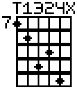

# chordboard

Simple tool to create guitar fretboard diagrams.

It can output images.  For instance:

```
$ # Awful chord to show off notation, image scaled up 3x
$ ./main.py 7,8,10,9,11,X T,1,3,2,4,X -o demo.png -x 3
```

produces the demo.png in this repo:



Or it can output to the console:

```
$ # C major
$ ./main.py X,3,2,0,1,0 X,3,2,0,1,0
  X 3 2 0 1 0
  -----------
  | | | | * |
  | | * | | |
  | * | | | |
  | | | | | |
  | | | | | |
$ 
$ # Hendrix-style
$ ./main.py 0,7,6,7,8,0 0,2,1,3,4,0
  0 2 1 3 4 0
  -----------
6 | | * | | |
  | * | * | |
  | | | | * |
  | | | | | |
  | | | | | |
$ 
$ # Same thing, but notated in fifth position
$ ./main.py -p5 0,3,2,3,4,0 0,2,1,3,4,0
  0 2 1 3 4 0
  -----------
5 | | | | | |
  | | * | | |
  | * | * | |
  | | | | * |
  | | | | | |
$ 
```

There are many tools to generate images that look almost like this, but all
of them get it slightly wrong (and are closed source, so I can't fix them).

I hope your music goes well!

## genmnemo.py

Tool that generates a mnemosnye-compatibile file of cards for import.
